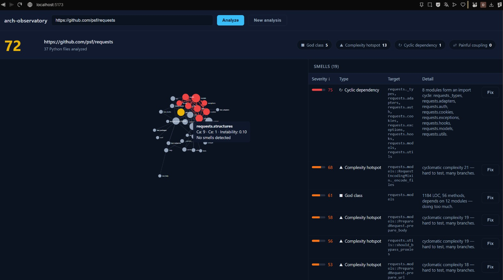
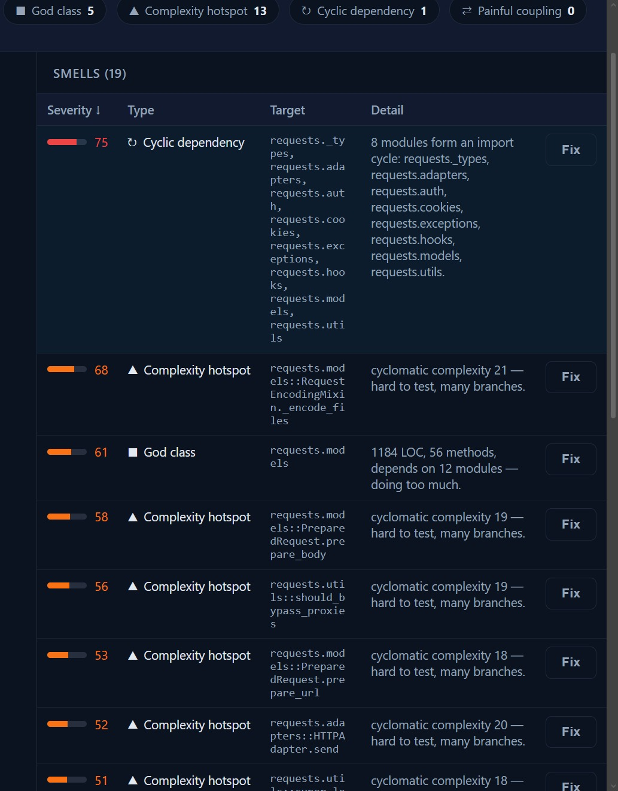
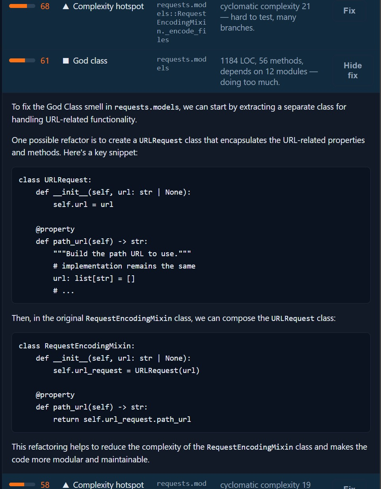
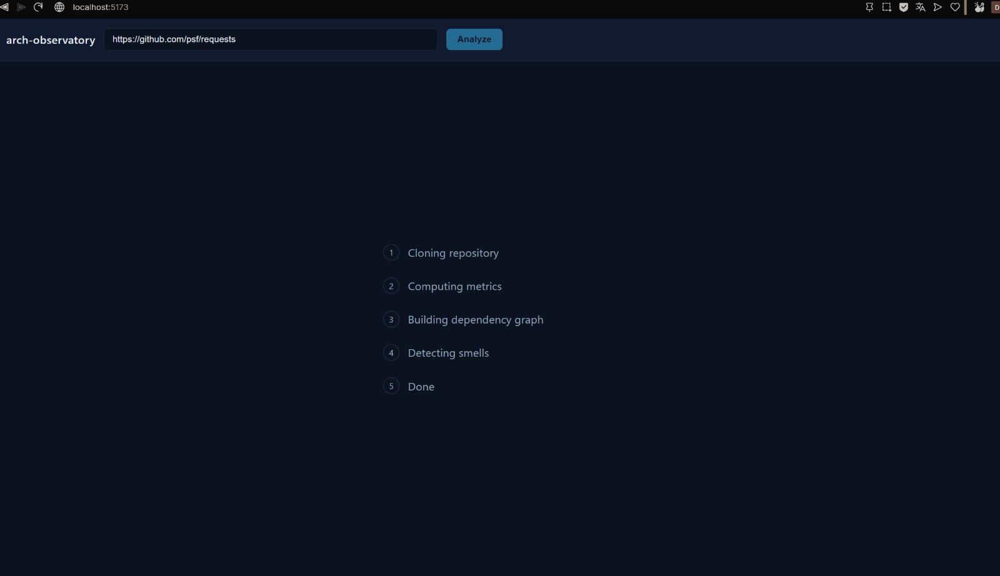

# Architecture Observatory

Point it at a public Python repo, get an architectural health report: import
cycles, god classes, complexity hotspots, and dangerous coupling — each ranked
by severity, mapped onto an interactive dependency graph, with on-demand LLM
refactor suggestions.

Static analysis only. The tool **never executes cloned code** — it clones to an
isolated temp directory, parses the source, and deletes the clone. See
[Security model](#security-model).



*Analyzing `pallets/flask`: a 17-module import cycle glowing red in the graph,
alongside the ranked smell table.*

---

## What it does

Paste a GitHub URL and the tool:

1. Safely clones and enumerates the repo's Python files (no code execution).
2. Computes per-file metrics with [radon](https://radon.readthedocs.io):
   cyclomatic complexity, maintainability index, Halstead volume, raw LOC.
3. Builds an internal-module dependency graph from the import statements and
   detects cycles and coupling using graph theory.
4. Synthesizes the metrics into named, ranked **smells** and an overall
   **health score** (0–100).
5. Renders it all as an interactive D3 force-directed graph cross-linked to a
   sortable smell table.
6. On click, asks an LLM for a targeted refactor suggestion for any single
   smell.

On a mature library like `psf/requests`, the tool reports a health score
around 72 — honest for well-maintained code that still carries a real 8-module
import cycle and a few genuinely complex functions (`_encode_files` at
cyclomatic complexity 21). On messier internals like `pallets/flask`, it
surfaces a 17-module cycle. The point is to read like a senior engineer's
review, not a pass/fail linter.

---

## The smells it detects

| Smell | Signal | What it means |
|---|---|---|
| **Cyclic dependency** | A strongly-connected component of size > 1 in the module graph | Modules that import each other in a loop — hard to test, reason about, or extract |
| **God class** | Large file + many methods + high efferent coupling (≥ 2 of 3) | One file doing too much; a change magnet |
| **Complexity hotspot** | A function over the cyclomatic-complexity threshold, worse if its file's maintainability index is low | Hard-to-test, many-branch code |
| **Painful coupling** | High afferent coupling *and* high instability | Lots of code depends on something that itself changes often — the dangerous combination |

Each smell carries a severity (0–100), the exact target (`module::function`),
the raw metrics behind it, and a one-sentence explanation.



*Sortable smell table, cross-linked to the graph — click a row to isolate the
module in the graph, click a smell to request a fix.*

---

## Why this is more than a metrics dump

Two design choices do most of the work.

**SCC-first cycle detection.** Naively enumerating every cycle in a dependency
graph (`networkx.simple_cycles` on the whole graph) can blow up
combinatorially. Instead, the tool computes strongly-connected components
first, treats any component of size > 1 as a cyclic cluster, and only
enumerates concrete cycles *within* those clusters. The report shows the
cluster membership — "these N modules form a cycle" — which is the useful fact,
not the hundreds of ways to traverse it.

**Martin's coupling metrics.** Each module gets afferent coupling (Ca, how many
modules depend on it), efferent coupling (Ce, how many it depends on), and
instability `I = Ce / (Ca + Ce)`. A module that is both heavily depended-on and
unstable is flagged as *painful coupling* — the tool isn't just counting
imports, it's applying the reasoning a reviewer would.

Test files are deliberately excluded from god-class detection: a suite with 200
one-line test functions is a big file, but it isn't one class doing too much.
That distinction — the metric fired, but it was measuring the wrong thing for
that file type — is the kind of judgment that separates a useful tool from a
noisy one.

---

## Security model

Cloning a repo and running any of its code is remote code execution. This tool
is built so that never happens:

- **No shell.** Git is invoked via a subprocess *argument list*, never
  `shell=True` and never string interpolation — so a hostile URL can't inject
  commands.
- **No execution of cloned code.** Python files are only ever opened as UTF-8
  text and parsed via `ast` / radon. Nothing in the clone is imported,
  compiled, or run — no `setup.py`, no `pip install`.
- **Always cleaned up.** The clone lives in a `tempfile.mkdtemp()` directory
  deleted in a `finally` block that runs on success, failure, or timeout.
- **Bounded.** Repo size, file count, Python-file count, and clone timeout are
  all capped before any deep work begins, so a giant or malicious repo can't
  wedge the process.
- **URL allowlisting.** Only `https://github.com/owner/repo` is accepted;
  scheme, host, embedded credentials, query, fragment, and character set are
  all validated before a clone is attempted.

---

## On-demand LLM fix suggestions

The fix layer is deliberately lazy and additive — the tool is fully functional
without it.

- Suggestions are generated **only when a user clicks a smell**, never during
  analysis, so no tokens are spent on smells nobody looks at.
- The LLM receives **only the relevant code span plus metric context**, never a
  whole file — cheaper, faster, and it produces sharper suggestions because the
  model isn't distracted by unrelated code. The spans are captured during
  analysis (while the source is still in memory) and stored, so no re-cloning is
  needed at fix time.
- Results are **cached in MongoDB** per (run, smell), so re-clicking is instant.
- If no API key is configured, the endpoint returns a clean 503 and the rest of
  the app is unaffected.



*Clicking a smell asks the LLM for a targeted refactor, scoped to just that
function's code span plus metric context.*

---

## Architecture

FARM stack — FastAPI, React, MongoDB — plus D3 for the graph.

```
Frontend (Vite + React)
  DependencyGraph.jsx   raw D3 force-directed graph, color-by-severity,
                        cycle edges highlighted, click-to-isolate
  SmellTable.jsx        sortable, cross-linked to the graph
  HealthHeader.jsx      score + smell-type counts
  RunProgress.jsx       staged progress (cloning → metrics → graph → smells)
  FixPanel.jsx          on-demand LLM suggestion per smell

Backend (FastAPI + motor)
  services/repo_url.py     strict GitHub URL validation
  services/ingest.py       safe clone → enumerate → orchestrate (with cleanup)
  services/metrics.py      radon: complexity, MI, Halstead, raw LOC
  services/depgraph.py     import extraction, module resolution, networkx graph,
                           SCC cycle detection, Martin coupling metrics
  services/smells.py       synthesis → ranked smells + health score
  services/fix_context.py  builds the code/context span for the LLM
  services/llm.py          LLM fix generation
  routers/analyze.py       POST /analyze, GET /runs/{run_id}
  routers/fixes.py         POST /runs/{run_id}/fix (lazy, cached)

MongoDB  runs, repos, cached fix suggestions
```

The analysis pipeline (metrics → graph → smells → span capture) all runs in a
single ingest pass while the clone exists on disk, before cleanup.

---

## Running locally

Requirements: Python 3.11+, Node 18+, Docker (for MongoDB), and git on PATH.

```bash
# 1. Start MongoDB
docker compose up -d

# 2. Backend
cd backend
python -m venv .venv
.venv/Scripts/activate          # Windows
# source .venv/bin/activate     # macOS / Linux
pip install -r requirements.txt
cp .env.example .env            # set MONGO_URI, DB_NAME, and optionally GROQ_API_KEY
uvicorn app.main:app --reload --port 8000

# 3. Frontend
cd ../frontend
npm install
cp .env.example .env            # point at http://localhost:8000
npm run dev                     # http://localhost:5173
```

Open the frontend, paste a Python repo URL (try `psf/requests` or
`pallets/flask`), and watch it analyze.



*Staged progress while a run is in flight: cloning → metrics → graph → smells.*

LLM fix suggestions require a `GROQ_API_KEY` in `backend/.env`. Without one, the
rest of the tool works and the fix endpoint returns a clean "not configured"
response.

---

## Tech stack

- **Backend:** FastAPI, motor (async MongoDB), radon, networkx, ast
- **Frontend:** React, Vite, D3 (raw force simulation)
- **LLM:** Groq
- **Infra:** MongoDB, Docker Compose

---

## Testing

```bash
cd backend
pytest -q
```

The suite covers URL validation, metric extraction (including unparseable
files), dependency resolution and cycle detection, smell synthesis and
severity ordering, and the fix-cache behaviour (with the LLM call mocked — no
network in tests).